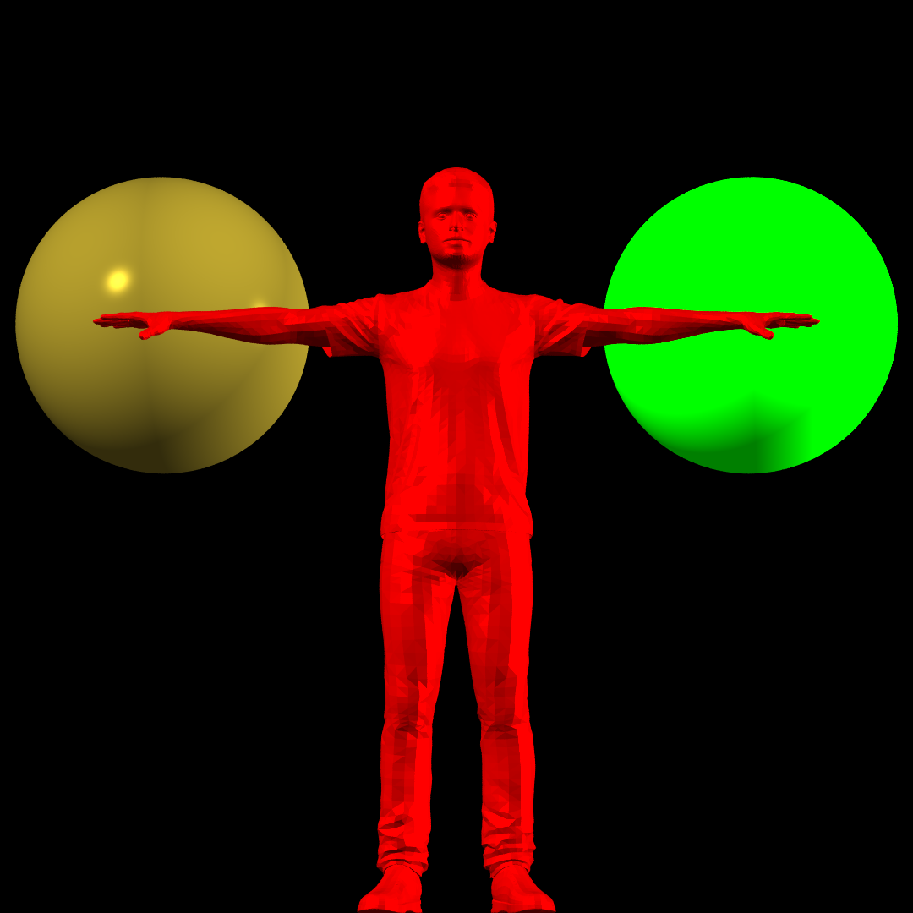
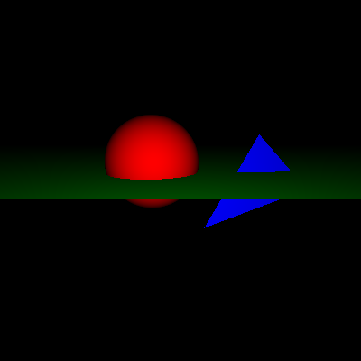

# Raytracer

## Description

This is a raytracing engine written in C++.

## Features

### Geometric primitives

- Sphere
- Plane
- Triangle

### Materials

- Phong
- Matte
- Cosine

### Lights

- Point light
- Ambient light
- Spot light

### Camera

- Perspective camera
- Parallel camera

### Anti-aliasing

- Simple sampling
- Regular sampling
- Random sampling
- Jittered sampling

### Acceleration structures

- Uniform grid
- Bounding volume hierarchy

## Build

### Requirements

- C++ compiler

### Instructions

```bash
git clone
cd raytracer
```
#### Custom Script (Windows)

```bash
./run.bat buildName
```

#### Manual

```bash
g++ raytracer.cpp tracer/*.cpp cameras/*.cpp geometry/*.cpp lights/*.cpp materials/*.cpp samplers/*.cpp acceleration/*.cpp utilities/*.cpp world/*.cpp build/"build%source_file%".cpp -o a.exe

./a.exe
```

The raytracer will output a ppm file in the raytracer folder. To convert the ppm file to a png file, run the following command:

```bash
python convert.py $source_file
```

## Examples

### Babar Azam

The following image was rendered using the following settings:

- 1000 x 1000 resolution
- Jittered sampling
- 25 samples per pixel
- Grid acceleration structure
- Perspective camera
- Phong material

by running the following command:

```bash
./run.bat BabarAzam
```




### Hello World

The following image was rendered using the following settings:

- 400 x 400 resolution
- Simple sampling
- 1 sample per pixel
- No acceleration structure
- Perspective camera
- Cosine material

by running the following command:

```bash
./run.bat HelloWorld
```



## Acknowledgements

- [Ray Tracing from the Ground Up - Kevin Suffern](https://www.amazon.com/Ray-Tracing-Ground-Kevin-Suffern/dp/1568812728)
- [Sketchfab](https://sketchfab.com/)
- [Dr. Waqar Saleem](https://github.com/waqarsaleem)